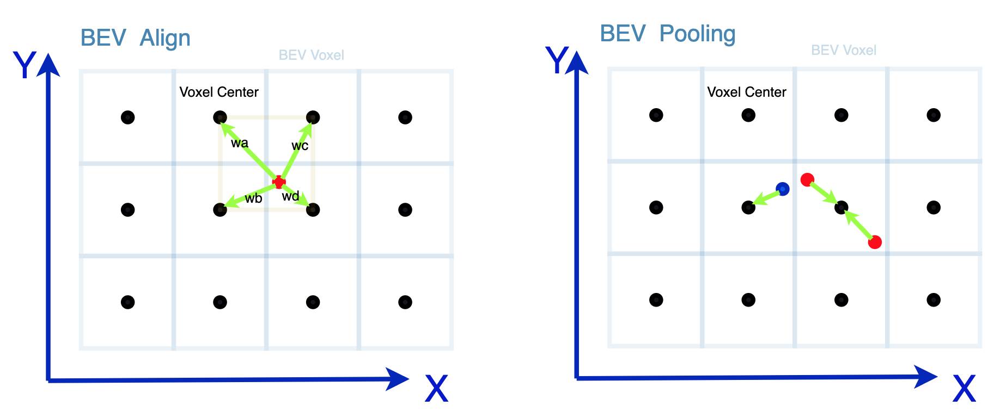

# BEV Pooling and BEV Align Source Code 



Bev Pooling plays a vital role in BEV-based mono/stereo 3D detection methods like BEVDet/BEVDetph, which directly project 3d obejcts from image view to birds-eye-view according computed indexs. However we note that Bev Pooling suffers from precesion loss when converting float-indexs to quanted ones, therefore two points being assigned to the same voxel may have longer distance than that of points being assigned to different voxels. 

This project provide a better solution called bev align, that assigning a point to its 4 nearest voxels, and weight its assigned value in every channel according to its distances to the voxels, the whole process is achived in a inverse-bilinear-interpolation way, see the above figure.

## Illustration

### BEV Align :
#### get bev float-indexs from image space
$Geom(u,v) = (x,y)$ 
#### Compute 4 nerest bev quanted indexs
$x_0 = \lfloor x-0.5 \rfloor$
$;y_0 = \lfloor y-0.5 \rfloor$

$x_1 = \lceil x-0.5 \rceil$
$;y_1 = \lceil y-0.5 \rceil$

#### Compute weights based on distance
$w_a = (x_1 - x) * (y_1 - y)$
$;w_b = (x_1 - x) * (y - y_0)$
$;w_c = (x - x_0) * (y_1 - y)$
$;w_d = (x - x_0) * (y - y_0)$

#### Assign image features to 4 nerest bev voxels according to their weights
$F_{bev}(x_0,y_0) = F_{img}(u,v) * w_a $ 
$;F_{bev}(x_0,y_1) = F_{img}(u,v) * w_b $
$;F_{bev}(x_1,y_0) = F_{img}(u,v) * w_c $
$;F_{bev}(x_1,y_1) = F_{img}(u,v) * w_d $

### BEV Pooling :

Directly compute quanted bev indexs, and assign image features to that bev voxel

$Geom(u,v) = (x,y) $

$x_0 = \lfloor x \rfloor$
$;y_0 = \lfloor y \rfloor$

$F_{bev}(x_0,y_0) = F_{img}(u,v)$ 


Please see readme.pdf to learn more experiment records. 

## Configure
Please move this project to [BEVDet](https://github.com/HuangJunJie2017/BEVDet), replace the old one 
```
rm -rf ${THIS_PROJECT} ${BEVDet_Path}/mmdet3d/ops/bev_pool
mv ${THIS_PROJECT} ${BEVDet_Path}/mmdet3d/ops/bev_pool
```


Add import item in `${BEVDet_Path}/mmdet3d/ops/__init__.py` :
```
from .bev_pool.voxel_align import voxel_pool,voxel_align

__all__.extend(['voxel_align','voxel_pool'])
```

Add source file in `${BEVDet_Path}/setup.py` cuda extend item , replace the old one with : 
```
make_cuda_ext(
    name="bev_pool_ext",
    module="mmdet3d.ops.bev_pool",
    sources=[
        "src/bev_pool.cpp",
        "src/bev_pool_cuda.cu",
        "src/bev_align_cuda.cu",
        "src/bev_align_cuda_v2.cu"
    ],
),
```
## Install 

Then recompiling the bevdet source code 

```
cd ${THIS_PROJECT} ${BEVDet_Path}
pip install -v -e .
```

## Updates
[2023-02-21] support `voxel_align_fast`, which achieves the same result while 4 times faster than the `voxel_align`, it also minimize the gpu memory by a large margin, see the below example .
 
## Example
```
from mmdet3d.ops import voxel_pool, voxel_align, voxel_align_fast
import torch
bev_h = 64
bev_w = 128
img_output_h=16 # img feature map height
img_output_w=44 # img feature map width
img_output_c=64 # img feature map feature channels
img_output_d=59 # img feature map depth channels
batch_size = 1 # batch size 
sensor_num = 1 # how many sensors

depth = torch.randn([batch_size, sensor_num, img_output_d, img_output_h, img_output_w]).float()
img_feat = torch.randn([batch_size, sensor_num, img_output_c, img_output_h, img_output_w]).float()
volume = depth.unsqueeze(2) * img_feat.unsqueeze(3)
volume = volume.permute(0, 1, 3, 4, 5, 2)
geom_feats = torch.randn([batch_size, sensor_num,img_output_d, img_output_h, img_output_w,3]) * 30
# please strictly follow the above data shape format and data dtype
output_pool = voxel_pool(volume.cuda(), geom_feats.cuda(), bev_h,bev_w)
output_align = voxel_align(volume.cuda(), geom_feats.cuda(), bev_h,bev_w)
output_align_fast = voxel_align_fast(depth.cuda(), img_feat.cuda(), geom_feats.cuda(), bev_h,bev_w)
diff = torch.sum(torch.abs(output_align-output_align_fast))
print(f"diffence between `voxel_align` and `voxel_align_fast` is {diff}!")
print(output_pool.shape)
print(output_align.shape)
```


